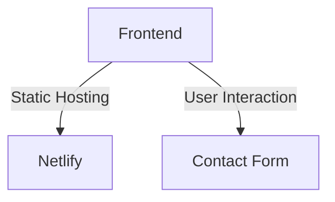

# Lewis Gitonga - Medical Technologist Portfolio:

A cutting-edge portfolio showcasing my work at the intersection of medicine and AI technology.

## 🌟 Key Features

- **Responsive Design**: A medical-tech hybrid UI optimized for all devices.
- **Dark/Light Modes**: Toggle between themes for better user experience.
- **Performance Optimized**: Fast-loading pages with responsive animations.
- **Dynamic Footer Year**: Automatically updates to the current year.

## 🛠 Technical Architecture



## 🧩 Technology Stack

- HTML5
- CSS3
- JavaScript ES6+
- Font Awesome
- Netlify Hosting

## 🚀 Quick Deployment

### Link to my Website

[Visit Portfolio](https://toshlewiportfolio.netlify.app/)

```bash
# Clone repository
git clone https://github.com/toshlewi/My-Portfolio.git
cd portfolio
```

**Requirements**:

- Modern browser for optimal performance.

## 📬 Contact

For collaborations:

- 📧 adelewigitz@gmail.com
- 📞 +254 711 527211
- 🔗 [LinkedIn Profile](https://linkedin.com/in/lewis-gitonga-12783b34a)
