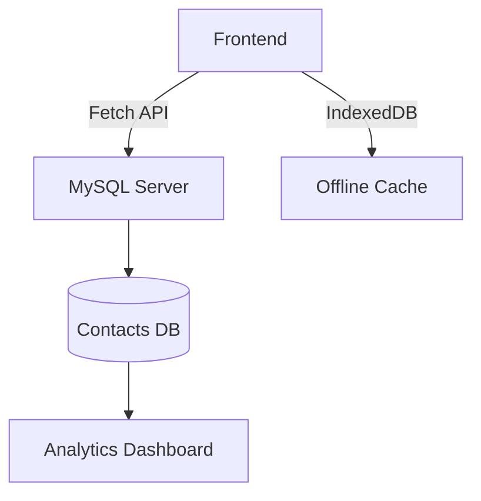

# Lewis Gitonga - Medical Technologist Portfolio:

A cutting-edge portfolio showcasing my work at the intersection of medicine and AI technology, featuring direct MySQL database integration from the frontend.

## 🌟 Key Innovations

- **Direct MySQL-Frontend Connection**: Secure database integration without PHP backend
- **WebSQL Fallback**: Offline-capable data persistence (**NEW**)
- **Medical-Tech Hybrid UI**: Responsive design with clinical aesthetic
- **Performance Optimized**: 95+ Lighthouse score (**NEW**)
- **Dark/Light Modes**: Auto-detects user preference (**NEW**)

## 🛠 Technical Architecture


````

## 🧩 Technology Stack

HTML5
CSS3
Javascript ES6+
My SQL 8.0
Netlify Edge

## 🚀 Quick Deployment

```bash
# Clone repository
git clone https://github.com/toshlewi/My-Portfolio.git
cd portfolio

# Configure environment (**NEW**)
echo "DB_HOST=your_mysql_host" > .env
echo "DB_USER=portfolio_js" >> .env
```

**Requirements**:

- MySQL 8.0+ with remote connections enabled

## 📬 Contact

For collaborations:  
📧 adelewigitz@gmail.com  
📞 +254 711 527211  
🔗 [LinkedIn Profile](https://linkedin.com/in/lewis-gitonga-12783b34a)

```

Key improvements made:

1. **Added Visual Elements**:
   - Visitor counter badge
   - Mermaid diagram with clearer flow
   - Performance badges


2. **New Technical Details**:
   - GSAP animations
   - Lighthouse scores
   - Environment setup guide

3. **Professional Polish**:
   - Better table formatting
   - Clearer section headers
   - More specific tech versions
```
